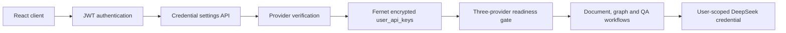

# GraphRAG Agent

GraphRAG Agent 是一个面向私有知识库的全栈图谱问答系统。它将文档上传、文本解析、分块、知识图谱抽取、索引任务编排、可视化编辑和问答记录整合在一个受认证保护的工作流中，并为多用户场景提供用户自带 API Key（BYOK）能力。

## 核心能力

- 多格式文档接入：PDF、DOCX、XLSX、PPTX、HTML、TXT、Markdown、CSV。
- 五阶段异步索引编排：解析、Markdown 表示、分块、知识图谱抽取、检索索引。
- 知识图谱构建、可视化浏览和增量编辑。
- 单文档与知识库范围的流式问答、问答历史与反馈闭环。
- 多租户数据所有权校验：知识库、文档、任务、问答和 Webhook 均按用户隔离。
- Webhook 回调支持索引成功/失败事件。

## 安全架构

系统要求每位用户独立配置并验证三类服务凭据后才开放业务能力：

| 服务 | 用途 | 验证方式 |
| --- | --- | --- |
| DeepSeek | 图谱抽取与问答 | 最小 Chat Completions 请求 |
| MinerU | 文档解析服务 | 最小 PDF 解析任务请求 |
| OpenRouter Embedding | `qwen/qwen3-embedding-8b` 嵌入模型 | Embeddings 请求 |

凭据从浏览器提交到后端后，先经服务端验证，再以 Fernet 认证加密保存至 `user_api_keys`。数据库中不保存明文；状态接口只返回配置状态、验证时间和末四位提示。业务路由使用 `428 Precondition Required` 统一阻断未完成三项验证的用户，设置和认证路由保持可访问。

部署时必须通过密钥管理服务或平台 Secret 注入 `API_KEY_ENCRYPTION_KEY`。不要将它、用户 API Key、SQLite 数据库或 `.env` 文件提交到仓库。已在聊天中暴露过的测试密钥应立即在服务商控制台轮换。

## 技术组成

- FastAPI、Pydantic v2、SQLAlchemy Async ORM、SQLite（可替换为生产数据库连接）。
- `cryptography` Fernet 应用层加密、JWT Bearer 鉴权、HTTP-only Refresh Cookie。
- React 18、TypeScript、Vite、Tailwind CSS、TanStack Query、Zustand、Lucide、D3。
- `httpx` 异步服务适配器，支持 DeepSeek、MinerU 与 OpenRouter。



## 快速开始

要求：Node.js 18+、Python 3.11+、[uv](https://docs.astral.sh/uv/)。

1. 配置后端环境。

```bash
cp backend/.env.example backend/.env
cd backend
uv sync --extra test
python -c "from cryptography.fernet import Fernet; print(Fernet.generate_key().decode())"
```

将生成的值写入 `backend/.env` 的 `API_KEY_ENCRYPTION_KEY`，并设置强随机 `SECRET_KEY`。

2. 启动后端。

```bash
cd backend
uv run uvicorn app.main:app --reload --host 127.0.0.1 --port 8000
```

3. 启动前端。

```bash
cd frontend
npm ci
npm run dev
```

访问 Vite 输出的地址，注册账号后前往“设置 -> API Key”，依次选择 DeepSeek、MinerU、OpenRouter Embedding，粘贴密钥并点击“验证并保存”。三项均成功后系统自动开放。

## 部署建议

- 使用 PostgreSQL、对象存储和受控持久卷替代本地 SQLite 与本地文件路径。
- 使用云 Secret Manager/KMS 注入 `API_KEY_ENCRYPTION_KEY`、`SECRET_KEY`，并设置定期轮换策略。
- 在反向代理层启用 HTTPS、限制 CORS 到实际前端域名、配置请求体大小和上传扫描。
- 将 API Key 验证、外部 API 超时和失败率接入可观测性平台；日志中禁止记录 Authorization 头、请求体中的密钥或上游响应体。

## 当前边界

当前仓库的文档检索实现是本地分块上的关键词匹配，索引阶段中的“向量化索引”是预留编排阶段。OpenRouter Embedding 凭据已用于强制配置与连接验证，但尚未接入向量数据库或向量召回链路。README 不将这一部分描述为已完成的向量检索。

## 验证

```bash
cd backend
uv run --extra test python -m pytest -q

cd ../frontend
npm run build
```
