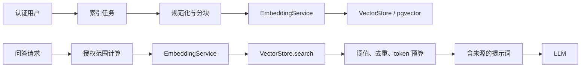
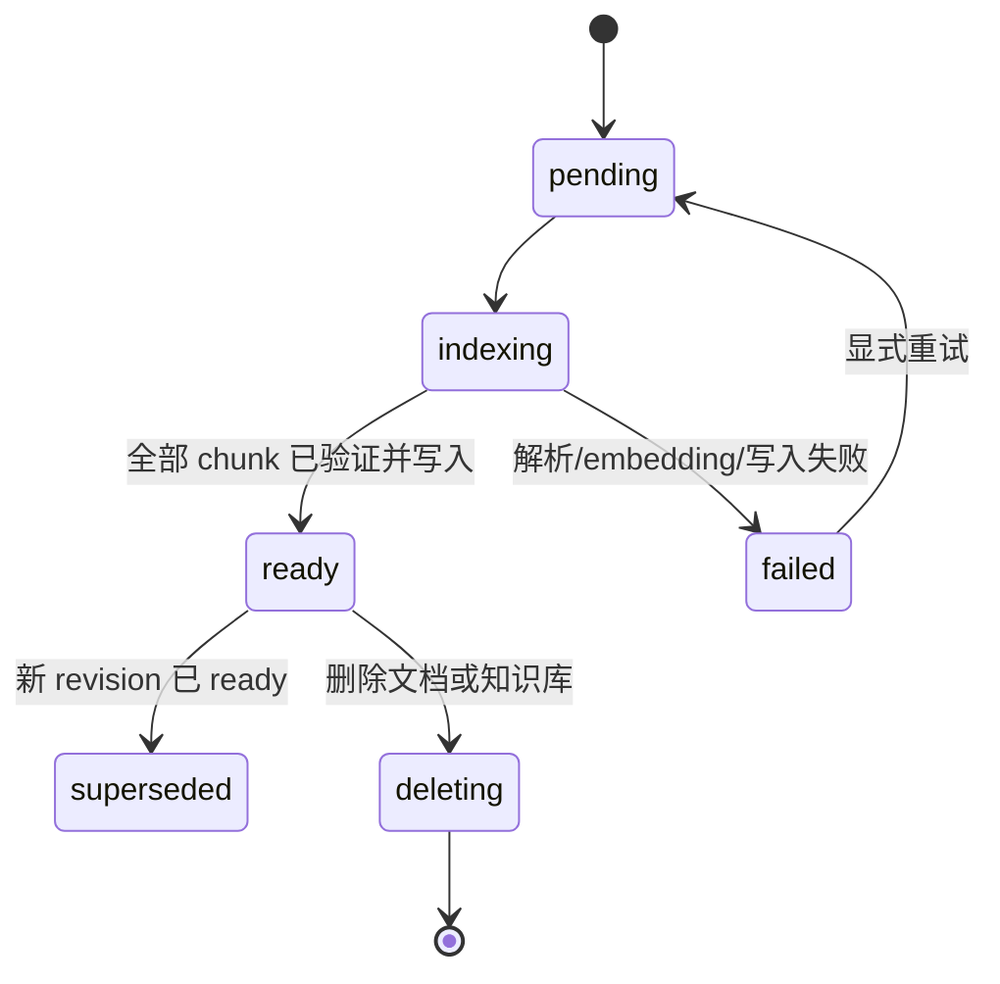

# 语义向量检索规范

> 状态：Draft  
> 版本：1.0  
> 日期：2026-08-04  
> 关联文档：[向量 RAG 方案与可行性评估](./vector-rag-feasibility.md)

## 1. 目标与范围

本规范定义 GraphRAG Agent 的第一阶段语义向量检索（semantic vector retrieval）实现。它将文档 chunk 变为可持久化、可过滤、可溯源的向量，并用于单文档和知识库问答的文本证据召回。

本阶段必须交付：

- 用户级 embedding 调用、批量索引、幂等重试和删除清理。
- 以 `owner_id`、`kb_id`、`doc_id` 为边界的向量 Top-K 检索。
- 对每个被用于回答的 chunk 返回可验证的来源信息。
- 索引版本、模型维度、chunk 策略的一致性约束。

本阶段不实现：RRF、reranker、实体向量、图谱 N-hop 遍历、社区检测和 Global GraphRAG。这些能力只能建立在本规范完成且通过评测之后。

## 2. 术语与规范性用语

- **MUST（必须）**：不满足即视为不合规，不能上线。
- **SHOULD（应当）**：默认实现，偏离时必须记录原因和验证结果。
- **MAY（可以）**：可选实现，不影响本阶段正确性。
- **chunk**：由单个文档解析文本切分出的、可独立嵌入和引用的文本单元。
- **index version**：绑定模型、向量维度、距离度量、chunk 策略的不可变版本标识。
- **active revision**：某文档当前唯一允许在查询中召回的完整索引版本。
- **检索边界**：服务端根据认证用户与授权资源计算出的 `owner_id`、`kb_id`、`doc_id` 集合。

## 3. 架构决策

### 3.1 存储与接口边界

生产环境 MUST 使用 PostgreSQL + pgvector。SQLite、内存索引和仅保存在 JSON 文件中的向量不得作为生产检索后端。

实现 MUST 提供两个独立服务接口：

```text
EmbeddingService.embed(texts, user_id, model) -> list[EmbeddingVector]
VectorStore.upsert(chunks, revision) -> None
VectorStore.search(query_vector, scope, revision, top_k) -> list[RetrievedChunk]
VectorStore.delete_document(doc_id, owner_id) -> None
```

业务服务不得在 `qa_service.py` 或路由层直接编写向量 SQL。这样能保留未来替换 Qdrant 的边界，同时避免权限过滤在多个位置漂移。

### 3.2 组件与数据流



`EmbeddingService` MUST 从 key vault 获取当前认证用户已验证的 `embedding` 凭据。前端不得提交或指定 API Key、`owner_id`、embedding 模型或向量库过滤表达式。

## 4. 索引版本契约

### 4.1 `IndexProfile`

每个 index version MUST 对应一个不可变 `IndexProfile`：

| 字段 | 约束 |
| --- | --- |
| `index_version` | 非空、不可修改；例如 `semantic-v1` |
| `embedding_model` | 完整 provider 模型标识；默认 `qwen/qwen3-embedding-8b` |
| `embedding_dimension` | 正整数；由一次成功的 provider 响应确认后写入配置/迁移，不得猜测或硬编码 |
| `distance_metric` | 本阶段固定为 `cosine` |
| `chunk_strategy` | 版本化 JSON；至少含 splitter、目标大小和 overlap |
| `normalization` | `provider` 或 `l2`；同一 version 必须一致 |
| `is_active` | 同一部署环境同一语义检索路径只能有一个 active profile |

模型、维度、距离度量、文本规范化规则或 chunk 策略任何一项发生变化时，MUST 创建新 version 并重建索引。不同 version 的向量 MUST NOT 在同一个查询结果中混排。

### 4.2 启动与迁移规则

1. 部署前 MUST 通过真实 embedding 响应确认模型维度。
2. 数据库迁移 MUST 按确认的维度创建 `vector(n)` 列和 cosine 索引配置。
3. 新 version 上线前，所有历史 `indexed` 文档 MUST 进入重建队列；未重建的文档不能伪装为已完成语义索引。
4. active profile 切换 MUST 是显式运维操作，且只在目标重建覆盖率与验收指标达标后执行。

## 5. 数据模型

### 5.1 `document_chunks`

必须新增一个持久化表，推荐字段如下：

```text
document_chunks
  chunk_id              UUID / string UUID, primary key
  owner_id              string UUID, not null, FK users
  kb_id                 string UUID, nullable, FK knowledge_bases
  doc_id                string UUID, not null, FK documents
  revision_id           string UUID, not null, FK document_index_revisions
  chunk_index           integer, not null, >= 0
  page                  integer, nullable, >= 1
  char_start            integer, nullable, >= 0
  char_end              integer, nullable, > char_start
  content               text, not null, non-empty
  content_hash          char(64), not null, SHA-256 of normalized content
  embedding             vector(n), not null
  embedding_model       string, not null
  index_version         string, not null
  created_at            timestamp, not null
```

约束：

- `(revision_id, chunk_index)` MUST 唯一。
- `owner_id`、`kb_id` 与 `doc_id` 的归属 MUST 在写入前由服务端验证；不得信任解析器、LLM 或前端提供的这些字段。
- `content` MUST 是待嵌入的规范化内容；`content_hash` MUST 基于完全相同的规范化结果计算。
- 向量维度 MUST 等于 active `IndexProfile.embedding_dimension`，不匹配必须失败。
- 文本和向量都属于用户数据，MUST 不被记录到普通应用日志。

数据库 SHOULD 建立以下普通索引，向量索引不能替代它们：

```text
(owner_id, kb_id, doc_id, revision_id)
(doc_id, revision_id)
(owner_id, index_version)
```

### 5.2 `document_index_revisions`

必须引入文档级索引 revision，避免重建期间读到半成品向量：

```text
document_index_revisions
  revision_id           UUID / string UUID, primary key
  doc_id                string UUID, not null
  owner_id              string UUID, not null
  kb_id                 string UUID, nullable
  index_version         string, not null
  status                pending | indexing | ready | failed | superseded | deleting
  chunk_count_expected  integer, not null, >= 0
  chunk_count_indexed   integer, not null, >= 0
  error_code            string, nullable
  error_message         string, nullable, sanitized
  created_at, updated_at
```

查询 MUST 仅使用 `status = ready` 的 active revision。向量写入失败时，revision MUST 为 `failed`，文档状态 MUST NOT 因旧的或部分新向量而被标记为语义索引完成。

### 5.3 来源对象

每个进入 LLM 上下文的 chunk MUST 产生一个 `Source`，并写入 `QARecord.sources_json`：

```json
{
  "chunk_id": "uuid",
  "doc_id": "uuid",
  "doc_title": "quarterly-report.pdf",
  "page": 3,
  "chunk_index": 7,
  "score": 0.82,
  "retrieval_method": "semantic",
  "snippet": "最多 240 个字符的原文片段"
}
```

- `score` MUST 是用于排序的原始语义相似度或明确定义的归一化值，不得伪造为置信度。
- `snippet` MUST 来自该 `chunk_id` 的 `content`，不得由 LLM 生成。
- 任何不进入提示词的候选 MUST NOT 出现在答案来源中。

## 6. 文本规范化与分块规范

1. 文本 MUST 使用 UTF-8 处理并保留原始可读语言内容。
2. 规范化 MUST 至少执行换行统一、连续空白折叠和空 chunk 删除；所有实现都必须使用同一函数。
3. 文档解析器能够提供页码/字符偏移时，MUST 保存到 chunk 元数据；无法提供时允许为 `null`，不得伪造页码 `1`。
4. 分块 MUST 优先在标题、段落和句子边界断开；在不得已按长度切断时保留可配置 overlap。
5. 空白或规范化后为空的 chunk MUST NOT 请求 embedding 或写入向量库。
6. `chunk_index` MUST 按文档阅读顺序从 0 连续递增；它是稳定定位字段，不得用随机值替代。
7. 当前 `1200` 字符目标大小与 `150` 字符 overlap 仅作为 `semantic-v1` 候选参数。正式启用前 MUST 写入 `IndexProfile.chunk_strategy` 并通过评测验证。

## 7. 索引流程

### 7.1 状态机



### 7.2 处理步骤

1. 在当前事务内读取 `Document`，MUST 验证 `document.owner_id == authenticated_user_id`。
2. 创建 `pending` revision，并记录预期 chunk 数；旧 ready revision 此时继续可查询。
3. 解析、规范化、分块，构造带服务端归属字段的 `ChunkRecord`。
4. 用 `content_hash + index_version` 查询本 revision 或可复用的相同内容向量；只对未命中缓存的 chunk 请求 embedding。
5. 按配置批量调用 provider。初始默认批次为 32，允许在 `16-64` 内配置。
6. 验证 provider 返回数量、顺序和每个向量维度；任一不一致 MUST 使当前批次失败。
7. 通过 `VectorStore.upsert` 写入全部 chunk。upsert MUST 以 `(revision_id, chunk_index)` 幂等。
8. 仅在 `chunk_count_indexed == chunk_count_expected` 后，将 revision 原子更新为 `ready`；再将旧 active revision 标为 `superseded`。
9. 任务进度中的 `vector` 阶段只有在 revision `ready` 后才能显示 `completed`。

### 7.3 错误与重试

- 网络超时、HTTP `408`、`429`、`5xx` SHOULD 采用指数退避加随机抖动，最多 3 次；重试次数和最后错误码必须记录。
- `400`、`401`、`403`、模型不存在、向量维度不匹配、输入不合法 MUST NOT 自动重试。
- 失败信息 MUST 脱敏：不得包含 API Key、Authorization Header、完整 chunk、完整 provider 响应或堆栈中的秘密。
- 对已存在的同一 `content_hash + index_version` 成功结果，重试 MUST 复用或幂等 upsert，不得制造重复向量。

## 8. 查询与授权规范

### 8.1 请求边界

语义检索只可从受认证的 QA 路由调用。请求中允许携带 `doc_id` 或 `kb_id`/`doc_ids`，但服务端 MUST：

1. 根据 JWT 的 `user_id` 加载目标文档和知识库。
2. 拒绝所有 `owner_id != user_id` 的资源；不能只按 `doc_id` 查询。
3. 校验每个 `doc_id` 实际属于提供的 `kb_id`（若指定），并去重。
4. 将最终授权文档集合和 `user_id` 传给 `VectorStore.search`；客户端提供的任意过滤条件不得直传到向量库。

单文档和知识库联合问答 MUST 使用同一授权函数。任何一条查询路径漏掉 `owner_id` 都是 P0 安全缺陷。

### 8.2 向量检索算法

```text
scope = authorized_scope(authenticated_user, requested_kb, requested_docs)
query_vector = embed(question, authenticated_user, active_profile.model)
candidates = vector_store.search(
    query_vector=query_vector,
    owner_id=scope.owner_id,
    kb_id=scope.kb_id,
    doc_ids=scope.doc_ids,
    index_version=active_profile.index_version,
    revision_status="ready",
    top_k=candidate_k,
)
selected = dedupe_then_apply_threshold_and_token_budget(candidates)
```

约束：

- `owner_id`、`index_version` 与 ready revision 过滤 MUST 在实际数据库/向量库查询中执行，而不是从结果列表中二次过滤。
- 初始 `candidate_k` SHOULD 为 10；最终上下文 SHOULD 为 4-8 chunks。两个值 MUST 可配置，且变更需要评测记录。
- 最低相似度阈值 MUST 由离线评测确定并配置化；不得在代码中写死未经验证的 score。
- 候选去重 MUST 以 `chunk_id` 进行；相邻、文本高度重叠的 chunk SHOULD 通过 `content_hash` 或 overlap 规则抑制重复。
- 上下文组装 MUST 有明确 token/字符预算，超出预算时按检索排名截断，不能无限拼接。

### 8.3 无结果与降级

- 当没有候选通过阈值时，系统 MUST 返回空 `sources`，并让回答明确说明“未在已授权文档中找到足够证据”。
- 系统 MUST NOT 因语义检索为空而自动把整份文档、整张知识图谱或未过滤的 chunk 填入上下文。
- embedding provider 不可用时，QA 接口 MUST 返回受控的依赖错误；是否降级到关键词检索由后续 hybrid 规范定义。本规范的 `semantic` 模式不静默降级。

## 9. API 契约

### 9.1 检索模式

`QAOptions.retrieval_mode` MUST 收紧为枚举，不得继续接受任意字符串：

```text
kg_only       兼容旧行为；不属于语义检索成功路径
semantic      仅本规范定义的向量检索
hybrid        预留给关键词 + 向量 RRF；本阶段不得伪实现
graph_hybrid  预留给文本证据 + 图谱子图；本阶段不得伪实现
```

新前端在语义索引上线后 SHOULD 显式传 `semantic`。保留 `kg_only` 的兼容窗口与下线日期必须在发布说明中记录。

### 9.2 响应

非流式问答和 SSE `done` 事件 MUST 返回：

```json
{
  "query_id": "uuid",
  "answer": "...",
  "retrieval_mode_used": "semantic",
  "sources": [{ "chunk_id": "...", "doc_id": "...", "score": 0.82 }],
  "token_usage": { "input_tokens": 0, "output_tokens": 0, "total_tokens": 0 }
}
```

`retrieval_mode_used` MUST 表示实际执行的模式，不能仅回显用户输入。`QARecord.sources_json` MUST 保存与响应相同的完整来源对象。

## 10. 删除、重建与一致性

- 文档删除或所有权删除 MUST 创建删除任务，并按 `owner_id + doc_id` 删除全部 revision/chunk 向量。删除尚未完成前，查询 MUST 排除 `deleting` revision。
- 知识库删除 MUST 级联处理其文档和向量；不得只删除业务表记录。
- 文档重新索引 MUST 创建新 revision；旧 revision 仅在新 revision ready 后才可删除或标记 superseded。
- 任何向量 orphan（向量存在但文档、revision 或 owner 不存在）MUST 被巡检任务检测并删除。
- 任务取消 MUST 停止后续 provider 调用，并使未 ready revision 不可查询；清理可以异步重试。

## 11. 安全、隐私与可观测性

### 11.1 安全与隐私

- 仅在内存中解密和使用 embedding Key；MUST NOT 写入数据库、任务状态、日志、异常消息或 API 响应。
- 向量和 chunk 原文按用户数据处理。调试日志 SHOULD 只记录长度、哈希前缀（可选）和资源 ID，不记录原文。
- 向量库连接凭据 MUST 由环境/密钥管理系统注入，不得进入前端包、`.env.example` 的真实值或 Git 历史。
- 任何管理/重建接口 MUST 复用用户鉴权或明确的管理员鉴权，不能凭 doc_id 绕过授权。

### 11.2 最低指标

必须记录以下不含敏感内容的指标：

- embedding 请求数、批次大小、成功率、延迟、重试次数和 provider 错误码分布。
- revision 从创建到 ready/failed 的耗时、chunk 总数、索引覆盖率。
- 检索候选数、通过阈值数、score 分布、零命中率和上下文截断率。
- 按模式的答案反馈率、引用存在率和检索评测指标。

日志和指标 MUST 带 `index_version`，以便发现模型或策略变更导致的回归。

## 12. 测试与验收

### 12.1 必测单元场景

- 相同内容、相同 version 的重试不会产生重复 chunk。
- 空文本、维度不匹配、provider 返回数量不一致均会使 revision 失败。
- 指定他人 `doc_id`、他人 `kb_id` 或不匹配 `doc_id/kb_id` 的请求被拒绝，且 `VectorStore.search` 从未执行。
- 查询永远带有 `owner_id`、active `index_version` 和 `ready` revision 条件。
- 删除文档后，其 chunk 不能再被召回。
- `sources` 的 snippet、页码和 chunk ID 都能在对应持久化 chunk 中复核。

### 12.2 集成与回归场景

1. 上传文档 -> 建立 revision -> `vector` 阶段完成 -> `semantic` 问答返回真实来源。
2. 同义改写问题可召回标注 chunk，且 Recall@5 高于现有关键词基线。
3. 重新索引期间，查询只使用旧 ready revision；新 revision ready 后原子切换。
4. provider 限流或超时后，任务重试遵守次数上限，失败不暴露密钥或原文。
5. 对每个回答来源验证：实际进入 LLM 上下文的 chunk 集合与 `sources_json` 完全一致。

上线门槛：

- 零跨租户召回。
- 评测集 Recall@5 必须高于关键词基线；未达标不得将 `semantic` 设为默认模式。
- 100% `semantic` 成功回答都具有至少一个可复核来源；无证据回答必须是明确的空来源拒答。
- 新旧索引切换与文档删除均无可复现的 stale vector 召回。

## 13. 实施清单

1. 新增 PostgreSQL/pgvector migration、`IndexProfile`、`document_index_revisions`、`document_chunks`。
2. 实现 `embedding_service.py` 与 `vector_store.py`，并为其分别编写单元测试。
3. 将 `index_service.py` 的 vector 阶段替换为本规范的 revision 流程。
4. 将 `qa_service.py` 的关键词 `_retrieve_chunks` 调用替换为 `semantic` retriever；保持关键词实现供下一阶段 hybrid 复用。
5. 收紧 `QAOptions` 类型，补全非流式与 SSE 的真实 `sources`，并持久化到 `QARecord.sources_json`。
6. 添加历史文档重建任务、删除清理任务、仪表指标和离线评测集。
7. 在 staging 用真实用户隔离场景和可控 provider 失败场景完成验收后，再启用 `semantic` 默认模式。
