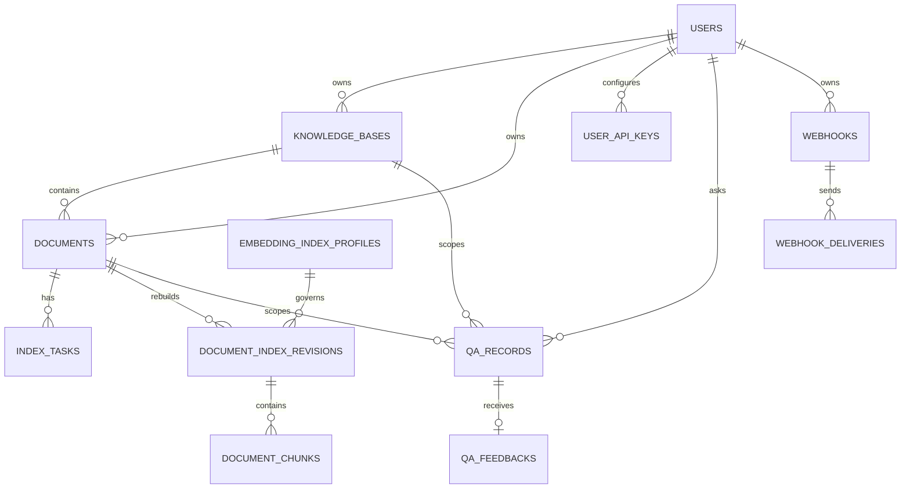
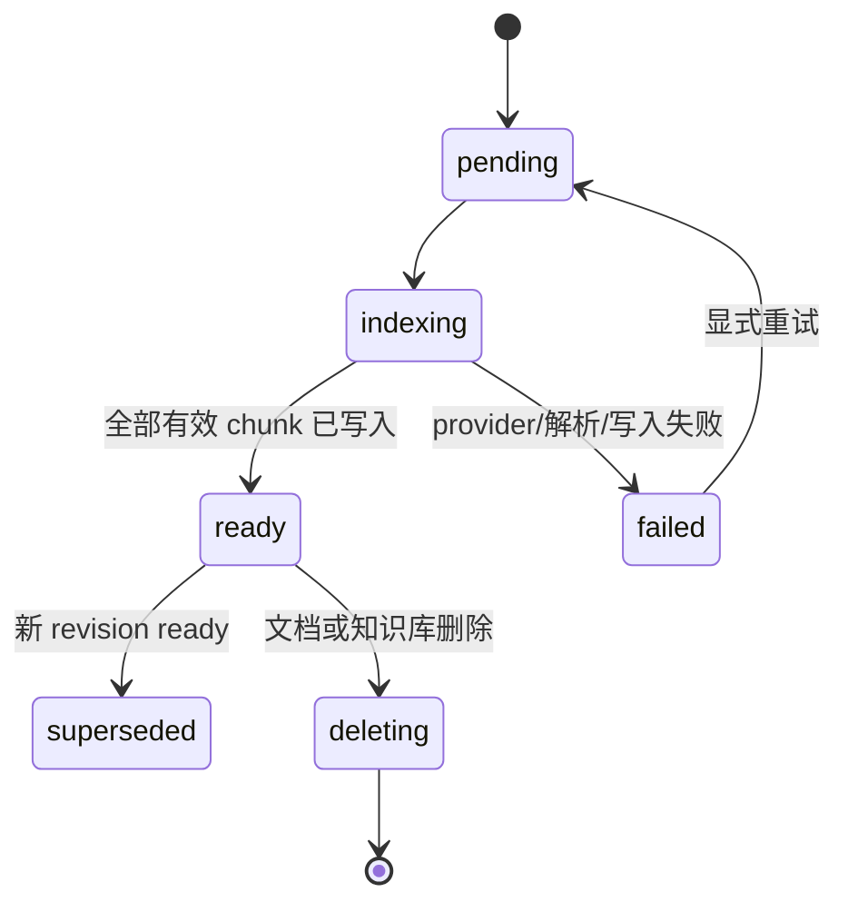

# GraphRAG Agent 向量 RAG 数据建模规范 v1.0

> 依据：[向量数据库选型与创建规范 v1.0](./vector-db-selection-and-provisioning-spec-v1.0.md)
> 可行性依据：[vector-rag-feasibility.md](./vector-rag-feasibility.md)
> 评审日期：2026-08-04
> 当前阶段：数据建模；不编写 ORM、SQL、迁移或业务代码

## 1. 目标与范围

本文定义 PostgreSQL + pgvector 落地所需的逻辑数据模型、关系、约束、索引、生命周期和迁移边界。模型同时覆盖现有业务实体与新增的语义向量实体，使文档、向量、租户权限、索引版本和问答来源可以在同一数据库中追溯。

本文不定义 embedding provider 调用、检索算法实现、HNSW 参数、关键词索引或知识图谱存储。知识图谱在本阶段继续作为文档级 JSON 产物，通过 `source_chunk_id` 关联文本证据。

## 2. 总体关系

所有可检索数据必须能沿 `document_chunks -> document_index_revisions -> documents -> owner_id` 回溯到租户。`owner_id` 不能仅依赖前端字段或向量查询结果后的二次过滤。

## 3. 现有业务实体基线

以下实体沿用当前业务模型，向量模型通过外键或逻辑约束接入，不重复创建用户和文档副本。

| 实体 | 主键 | 关键字段 | 建模要求 |
| --- | --- | --- | --- |
| `users` | `user_id` | username、email、created_at | 租户根；所有用户数据必须可由 `user_id` 归属 |
| `user_api_keys` | `key_id` | user_id、provider、encrypted_secret、is_verified | `(user_id, provider)` 唯一；只存密文，不进入向量表 |
| `knowledge_bases` | `kb_id` | owner_id、name、created_at | 一个用户拥有多个知识库 |
| `documents` | `doc_id` | owner_id、kb_id、status、filename、page_count | `kb_id` 非空时必须属于同一 `owner_id`；文档是 chunk 和 revision 的父实体 |
| `index_tasks` | `task_id` | doc_id、status、progress、stages_json | 记录解析、KG、vector 阶段；不作为向量查询状态来源 |
| `qa_records` | `query_id` | user_id、doc_id/kb_id、retrieval_mode、sources_json | 保存问答与来源快照；来源必须来自实际上下文 |
| `qa_feedbacks` | `feedback_id` | query_id、user_id、rating | 一个问答至多一条反馈，反馈用户必须与问答用户一致 |
| `webhooks` / `webhook_deliveries` | 各自 ID | owner_id、event、status | 与向量写入解耦；可订阅索引成功/失败事件 |

## 4. 向量域实体

### 4.1 `embedding_index_profiles`

该表是不可变的 embedding 与分块配置登记表。它解决“模型名称相同但维度/归一化或 chunk 策略不同”的歧义。

| 字段 | 类型约束 | 必填 | 规则 |
| --- | --- | --- | --- |
| `profile_id` | UUID，主键 | 是 | 内部稳定标识 |
| `index_version` | 非空字符串，唯一 | 是 | 对外可审计版本；变更后不得原地修改 |
| `provider` | 非空字符串 | 是 | 例如 OpenRouter |
| `embedding_model` | 非空字符串 | 是 | 完整 provider/model 标识 |
| `embedding_dimension` | 正整数 | 是 | 由真实响应确认，不得猜测 |
| `distance_metric` | 枚举 | 是 | v1 固定为 `cosine` |
| `normalization` | 枚举 | 是 | 记录 provider 已归一化或服务端归一化 |
| `chunk_strategy` | 结构化 JSON | 是 | splitter、目标大小、overlap、规范化规则 |
| `is_active` | 布尔 | 是 | 同一语义检索环境最多一个 active profile |
| `created_at` / `activated_at` | 带时区时间戳 | 是/否 | 记录登记与启用时间 |

profile 一旦被 revision 使用，不得修改模型、维度、距离、归一化和 chunk 策略；任何变化都创建新 profile 和新 `index_version`。

### 4.2 `document_index_revisions`

revision 表示某文档的一次完整向量索引构建，是重建的原子切换边界。

| 字段 | 类型约束 | 必填 | 规则 |
| --- | --- | --- | --- |
| `revision_id` | UUID，主键 | 是 | chunk 的父级幂等范围 |
| `doc_id` | 文档外键 | 是 | 必须属于 `owner_id` |
| `owner_id` | 用户外键 | 是 | 冗余保存以支持强制过滤和审计 |
| `kb_id` | 知识库外键，可空 | 否 | 必须与文档归属一致 |
| `profile_id` | `embedding_index_profiles` 外键 | 是 | 固定该 revision 的模型和维度 |
| `status` | 枚举 | 是 | `pending`、`indexing`、`ready`、`failed`、`superseded`、`deleting` |
| `chunk_count_expected` | 非负整数 | 是 | 分块完成后确定 |
| `chunk_count_indexed` | 非负整数 | 是 | 成功写入的有效 chunk 数 |
| `error_code` / `error_message` | 可空、脱敏 | 否 | 记录可重试/不可重试原因，不含密钥和完整原文 |
| `created_at` / `updated_at` | 带时区时间戳 | 是 | 状态变更审计 |

同一文档同一时间只能有一个 `ready` active revision。查询只允许使用 `ready` 且属于 active profile 的 revision；旧 revision 切换为 `superseded` 后不得默认召回。

### 4.3 `document_chunks`

每一行是一个可独立 embedding、检索和引用的文本证据单元。

| 字段 | 类型约束 | 必填 | 规则 |
| --- | --- | --- | --- |
| `chunk_id` | UUID/现有字符串 ID，主键 | 是 | 全局稳定；upsert、来源引用和删除的幂等键 |
| `revision_id` | revision 外键 | 是 | 决定模型、维度和可见性 |
| `owner_id` | 用户外键 | 是 | 服务端生成/校验；查询强制过滤 |
| `kb_id` | 知识库外键，可空 | 否 | 与文档归属一致 |
| `doc_id` | 文档外键 | 是 | 与 revision 归属一致 |
| `chunk_index` | 非负整数 | 是 | 同 revision 内从 0 开始、连续、唯一 |
| `page_start` / `page_end` | 非负整数，可空 | 否 | 可定位时填写；不能定位时为空 |
| `char_start` / `char_end` | 非负整数，可空 | 否 | 规范化文本半开区间 `[start, end)` |
| `content` | 非空文本 | 是 | 用于 embedding 和引用的规范化内容 |
| `content_hash` | SHA-256 等固定长度摘要 | 是 | 基于最终规范化 content 计算 |
| `embedding` | `vector(D)` | 是（ready 时） | D 必须等于 revision profile 的 dimension |
| `embedding_model` | 非空字符串 | 是（ready 时） | 与 profile 一致，便于审计和迁移 |
| `index_version` | 非空字符串 | 是 | 与 profile 一致，不允许跨版本混排 |
| `created_at` / `updated_at` | 带时区时间戳 | 是 | 写入和重算时间 |

必须满足以下一致性约束：

- `(revision_id, chunk_index)` 唯一；同一文档不同 revision 可以拥有相同 `chunk_index`。
- `doc_id`、`owner_id`、`kb_id` 必须与 revision 和父级实体一致；不一致的写入必须失败。
- `embedding` 维度、模型、距离和归一化必须匹配 revision 的 profile。
- `content_hash + embedding_model + index_version` 用于幂等判断，但唯一性不能错误地阻止不同文档保存相同文本。
- `content`、embedding、原始 API Key 和 Authorization Header 不得写入普通应用日志。

## 5. 关系与删除策略

### 5.1 关系约束

- `users 1:N knowledge_bases/documents/user_api_keys/qa_records/webhooks`。
- `knowledge_bases 1:N documents`；知识库删除触发其文档、revision、chunk 的一致性删除。
- `documents 1:N index_tasks/document_index_revisions/qa_records`。
- `document_index_revisions 1:N document_chunks`；revision 删除必须先删除或标记其 chunks。
- `qa_records 1:0..1 qa_feedbacks`；来源快照只记录已进入提示词的 chunk。

应用层必须执行归属校验，数据库层应以外键、唯一约束和必要的复合约束作为纵深防御。生产可启用 Row-Level Security，但不能替代应用授权。

### 5.2 生命周期

文档只有在 `chunk_count_indexed == chunk_count_expected` 且所有向量维度校验通过后，revision 才能变为 `ready`。重建流程为“新 revision 写入并校验 -> 切换 active -> 旧 revision 标记 superseded”，不得原地覆盖当前可查询版本。

## 6. 索引与查询相关模型约束

### 6.1 普通索引

至少需要以下逻辑索引：

| 索引范围 | 用途 |
| --- | --- |
| `document_chunks(owner_id)` | 租户隔离前置过滤 |
| `document_chunks(kb_id)` | 知识库范围检索 |
| `document_chunks(doc_id)` | 单文档检索和删除 |
| `document_chunks(revision_id, chunk_index)` | revision 完整性和顺序读取 |
| `document_index_revisions(doc_id, status)` | active/ready revision 定位 |
| `embedding_index_profiles(index_version, is_active)` | active profile 定位 |

向量索引初期不作为正确性保障。精确检索基线通过后，才根据数据量和 P95 延迟评估 HNSW/IVFFlat；近似索引必须与 active profile 绑定并单独验收。

### 6.2 查询边界

一次检索的有效范围由服务端根据 JWT 用户、授权知识库和授权文档计算，至少包含 `owner_id`、active `index_version`、`revision.status = ready`，以及可选的 `kb_id`/`doc_id`。客户端不得传入任意 SQL/向量过滤表达式。

## 7. 数据一致性与安全

- 文档、revision、chunk 的 owner/kb/doc 归属必须一致；任何跨租户或跨知识库组合均拒绝。
- provider 部分失败、超时、限流和维度错误只能使 revision 进入可见失败/待重试状态，不能将文档标记为完整索引。
- 删除文档/知识库时，向量删除与业务删除应在同一事务内完成；异步补偿需保留 tombstone，避免重试复活旧数据。
- 备份必须同时覆盖业务表、revision、chunk 元数据和 embedding；恢复演练必须能查询向量。
- 审计和指标只记录数量、耗时、版本、score 分布等非敏感信息，不记录原文、向量内容或密钥。

## 8. 迁移边界与验收

### 8.1 迁移边界

本阶段仅确定逻辑模型。后续迁移必须通过版本化 schema 变更创建 profile、revision 和 chunk 对象，补齐外键/唯一约束/索引，并验证 pgvector 扩展。生产不使用应用启动时的自动建表。

SQLite 开发数据不直接作为生产向量数据源；已有文档需要通过正式索引流水线重新分块、embedding 和写入。embedding 维度必须以真实 provider 响应确认后再确定物理 `vector(D)`。

### 8.2 验收标准

- 任意 chunk 可追溯到唯一文档、租户、revision、模型和来源位置。
- 同一 revision 的 `chunk_index` 连续且唯一；重复索引不会产生重复 chunk 或重复计费。
- 查询只召回授权租户、授权资源和 `ready` active revision 的 chunk。
- 新旧 revision 切换期间，查询不会看到半成品；旧 revision 切换后不再默认召回。
- 删除文档或知识库后无孤儿 revision/chunk，备份恢复后向量仍可查询。
- 真实 embedding 维度、cosine 距离、精确检索基线和后续近似索引决策均有记录。

## 9. 待确认项

- 托管 PostgreSQL 和 pgvector 的最终补丁版本及扩展权限；
- embedding 模型真实维度、最大输入、限流和成本；
- 页码/字符偏移在各文件格式解析器中的可用性；
- 目标数据量、并发、RPO/RTO 及是否需要 Row-Level Security；
- 30-50 条真实评测问题与 Recall@5、MRR、P95 延迟阈值。

## 10. 参考资料

- [向量数据库选型与创建规范 v1.0](./vector-db-selection-and-provisioning-spec-v1.0.md)
- [vector-rag-feasibility.md](./vector-rag-feasibility.md)
