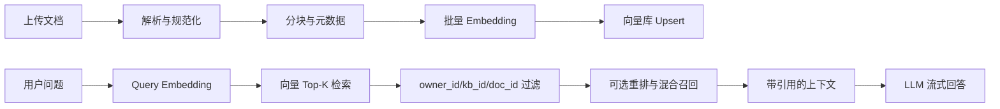
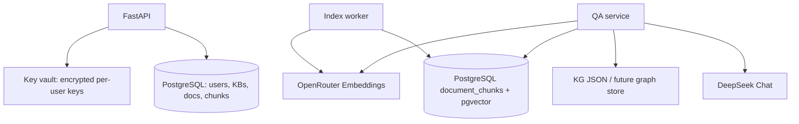
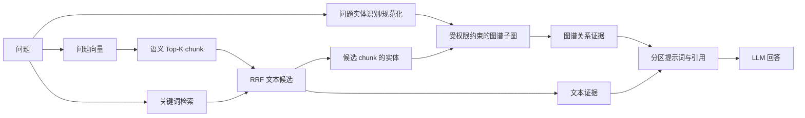

# GraphRAG Agent 向量 RAG 方案与可行性评估

> 评估日期：2026-08-04  
> 结论：**可行，建议实施。** 当前项目已完成文档分块、用户级 Embedding 凭据验证、问答上下文注入和多租户鉴权，缺少的是向量生成、向量持久化和相似度检索。应先落地带元数据过滤的语义检索，再将现有关键词与知识图谱接入混合召回。

实现级约束见：[语义向量检索规范](./semantic-vector-retrieval-spec.md)。

## 1. 当前状态

目前系统并非没有检索：上传文档会产生并持久化文本分块，问答时以问题 token 在每个 chunk 中出现的次数排序，取 Top-K 片段传给 LLM。这是关键词检索，不具备同义表达、跨语言表述或语义相近问题的召回能力。

项目已具备的基础：

| 能力 | 当前实现 | 对向量 RAG 的意义 |
| --- | --- | --- |
| 文档解析与分块 | `parsing_service.chunk_text()`，chunk 写入 `storage/chunks/{doc_id}.json` | 可直接作为 embedding 输入 |
| 索引任务 | parse -> markdown -> chunk -> KG -> vector 五阶段 | 可将现有占位的 vector 阶段替换为真实向量写入 |
| Embedding 凭据 | 用户的 OpenRouter Embedding Key 经服务端验证、加密存储 | 可按用户调用 embedding，避免平台统一持有用户 Key |
| 多租户 | 文档、知识库和 Key 均有 `owner_id` / `user_id` 约束 | 必须同步成为向量检索的强制过滤条件 |
| 流式问答与引用 | 知识库问答已返回 `sources` | 可改为返回真实 chunk、页码和相似度 |

主要缺口：

- 向量阶段只推进任务进度，没有生成或保存 embedding。
- `OpenRouter Embedding` 目前只在验证 API Key 时调用，并未在索引/问答路径中使用。
- `retrieval_mode` 被记录，但单文档问答没有据此选择不同的检索策略。
- chunk 只有纯字符串，缺少页码、位置、哈希、模型版本等可追溯元数据。

## 2. 向量 RAG 的标准流程



### 2.1 建库（ingestion）

1. 解析文本，去除无意义空白、页眉页脚和重复内容。
2. 按段落/标题优先切分，保留适量 overlap；当前 1,200 字符 + 150 字符 overlap 可以作为初始值，需通过中文文档样本调优。
3. 为每个 chunk 生成稳定 ID 和元数据：`owner_id`、`kb_id`、`doc_id`、`chunk_index`、`page`、`content`、`content_hash`、`embedding_model`、`index_version`。
4. 使用该用户已验证的 embedding Key 批量请求向量；不得记录 Authorization Header 或明文 Key。
5. 以 `chunk_id` 为幂等键 upsert 到向量库。相同 `content_hash + model + index_version` 可以跳过重复生成。
6. 仅在全部必要向量成功写入后，将文档标记为 `indexed`；失败时记录阶段错误，可安全重试/重建。

### 2.2 查询与生成（retrieval + generation）

1. 校验用户对知识库和文档的访问权。
2. 用同一 embedding 模型将问题向量化。
3. 在向量库检索 Top-K，并强制过滤 `owner_id`，再按 `kb_id`、被选中的 `doc_id` 限定范围。
4. 对低于阈值的结果不进入提示词；保留 chunk ID、文档名、页码和 score 作为引用。
5. 将上下文控制在 token 预算内。默认先取 8-12 个候选，最终传给 LLM 的 chunk 数量按长度截断。
6. 让 LLM 只基于检索内容回答；证据不足时明确说明，并返回可点击/可定位的来源。

## 3. 适合本项目的检索策略

### 阶段一：语义向量检索

这是最小、最有价值的闭环：语义 Top-K chunk + 来源引用 + LLM 回答。它直接修复现有关键词检索对“换一种说法”的召回不足，也不要求先改造知识图谱。

建议默认参数（上线前通过评测集校准）：

| 参数 | 初始建议 | 说明 |
| --- | --- | --- |
| embedding 模型 | `qwen/qwen3-embedding-8b` | 与当前 Key 验证配置保持一致；collection 维度必须由实际模型响应确定，不能写死 |
| embedding 批次 | 16-64 chunks | 受 provider 限流、输入长度和失败重试策略影响 |
| 召回候选数 | 10 | 供阈值过滤/重排使用 |
| 最终上下文 | 4-8 chunks | 以 LLM token 预算为准 |
| 最低 score | 以离线评测确定 | 不应未经数据验证硬编码相似度阈值 |

### 阶段二：混合检索

保留当前关键词检索，与向量检索并行召回，使用 Reciprocal Rank Fusion（RRF）融合排序。关键词对专有名词、编号、术语和精确字段更稳定；向量召回覆盖语义改写。二者应是互补关系，而非替换关系。

```text
候选 = RRF(向量 Top-10, 关键词 Top-10)
上下文 = 过滤低分、去重后取前 N 个候选
```

### 阶段三：图谱增强检索

当实体与关系由真实抽取结果稳定产出后，再把问题中的实体映射到图谱节点，检索 N-hop 子图并与文本 chunk 融合。不要把“图谱存在”误认为“天然完成 GraphRAG”：图谱召回、证据对齐和答案溯源均需要单独实现与评测。

推荐将 API 语义明确为：

| 模式 | 行为 |
| --- | --- |
| `semantic` | 仅向量检索文本 chunk |
| `hybrid` | 向量 + 关键词 RRF 融合 |
| `graph_hybrid` | hybrid 文本证据 + 图谱实体/子图证据 |

现有 `kg_only` 保留为兼容模式，不能再将其标签称为“混合检索”。

## 4. 向量存储选型

### 推荐：生产使用 PostgreSQL + pgvector

理由：项目部署建议本来就将 SQLite 替换为 PostgreSQL，业务数据和向量可在同一数据库中备份、事务化管理；`pgvector` 支持向量相似度搜索与近似索引。对于当前中小规模、多租户知识库，这个运维面最小。

该选型现已确定。实例创建、版本基线、数据契约、迁移边界、备份恢复和验收要求以 [向量数据库选型与创建规范 v1.0](./vector-db-selection-and-provisioning-spec-v1.0.md) 为准。本评估保留可行性结论和实施优先级，不再重复维护完整的数据库规范。

已决基线：生产使用 PostgreSQL 16+ 与 pgvector 0.8+；本地使用同大版本的 Docker PostgreSQL。`document_chunks` 是唯一的文本证据向量表，至少包含稳定 `chunk_id`、服务端校验的 `owner_id`/`kb_id`/`doc_id`、文档内 `chunk_index`、可用的页码和字符位置、规范化 `content`、`content_hash`、`embedding`、`embedding_model`、`index_version` 和审计时间。向量维度必须由真实 embedding 响应确认；模型、维度、距离度量或 chunk 策略变化时必须建立新 `index_version` 并重建，不能混用。

索引策略：先使用精确搜索完成正确性与评测；数据规模、P95 延迟和召回目标确定后才评估 HNSW/IVFFlat。必须为 `owner_id`、`kb_id`、`doc_id` 和幂等写入建立普通索引；授权过滤和活动 `index_version` 必须在实际数据库查询中执行，而不是在返回候选后再过滤。生产 schema、扩展与索引变更必须由版本化迁移流程执行，不能继续依赖应用启动时建表。

### 可选：Qdrant

Qdrant 将向量检索从业务数据库中解耦，原生提供 payload filter 与 hybrid query 能力，适合后续文档量更大、检索功能独立演进或需要专门向量集群的场景。

代价是多一个服务、备份面和网络故障点。只有在单 PostgreSQL 实例已无法满足已定义的数据量、并发或延迟目标时才重新评审。若选用它，应保持本文约定的 `chunk_id`、`index_version` 和租户过滤语义，并把 `owner_id` 过滤写成服务端不可省略的查询条件。

### 不建议作为正式方案：仅使用 SQLite 文件或内存索引

它们可做开发演示，但对于 Railway 多实例部署、持久化、并发写入、备份和可观测性都不合适。现有本地 SQLite 仍可继续承载开发环境的业务数据，生产向量存储应独立规划。

## 5. 推荐落地架构



设计约束：

- Embedding 请求必须使用当前用户自己的、已验证且解密后只在内存中存在的 Key。
- `owner_id` 是向量查询的必填过滤条件，不接受由前端传入且不经服务端验证的 owner 值。
- 删除文档/知识库时，同步删除其向量；可通过异步任务重试，并保留 tombstone/任务状态防止孤儿数据。
- 模型、向量维度、距离度量或 chunk 策略变化时建立新的 `index_version` 并重建；查询仅使用完整、活动的版本。
- 任一 provider 调用发生超时、限流或部分失败时，索引状态应可见且可重试，避免把不完整索引标记为完成。

## 6. 实施计划

### P0：设计与准备

- 按 [向量数据库选型与创建规范 v1.0](./vector-db-selection-and-provisioning-spec-v1.0.md) 创建 Railway PostgreSQL + pgvector 的预发布环境；本地使用同大版本 Docker PostgreSQL。
- 确认托管 PostgreSQL/pgvector 版本、扩展启用权限、SSL、连接池、备份、RPO/RTO 和磁盘预算。
- 明确 embedding 模型、最大输入、限流和按量成本；使用真实响应确认向量维度，并登记 `index_version` 的完整配置。
- 设计版本化迁移与文档索引重建流程；生产环境不使用启动时自动建表。
- 建立 30-50 个真实问题/文档片段组成的离线评测集，标注应命中的 chunk。

### P1：向量索引最小闭环

- 新增 `embedding_service.py`：批量 embedding、超时、有限重试、错误脱敏。
- 新增 `vector_store.py`：upsert、delete、filtered search；业务层不直接拼数据库向量 SQL。
- 在 `index_service.py` 的 vector 阶段真正写入 chunk 向量。
- 在 `qa_service.py` 中用语义 Top-K 替换或新增检索路径，并返回真实 `sources`。
- 为已有 `indexed` 文档提供一次性“重建向量索引”任务。

### P2：正确性、安全与可观测性

- 单元测试：chunk 元数据、重复 upsert、不同 owner 的过滤、删除级联、provider 异常。
- 集成测试：上传 -> 索引 -> 同义问法命中 -> 回答携带正确来源。
- 记录不含原文/密钥的指标：embedding 成功率、耗时、候选数、score 分布、零命中率、重试次数。
- 增加检索评测：Recall@K、MRR、人工答案忠实度和引用正确率。

### P3：混合检索与图谱增强

- 保留关键词召回，采用 RRF 融合；比较 semantic 与 hybrid 的评测指标。
- 加入 reranker 前，先证明它对评测集的增益足以覆盖时延与成本。
- 图谱数据来源稳定后实现实体对齐、子图召回和文本证据融合。

## 7. 验收标准

- 查询不会返回其他用户或未被授权知识库的 chunk。
- 已索引文档的每个有效 chunk 可追溯到文档、页码/位置和模型版本。
- 对评测集中的同义改写问题，语义检索的 Recall@5 高于当前关键词基线。
- 回答 API 返回真实来源，且来源片段确实被送入生成上下文。
- embedding、向量库和 LLM 任一失败都返回可理解的任务/问答错误，不泄漏密钥或完整原文。
- 删除或重建文档索引后，旧向量不会继续被召回。
- PostgreSQL/pgvector 版本、扩展可用性、维度一致性和备份恢复均通过预发布验收；恢复后的向量可正常查询。

## 8. 参考资料

- [向量数据库选型与创建规范 v1.0](./vector-db-selection-and-provisioning-spec-v1.0.md)：本项目 PostgreSQL + pgvector 的已决创建与运维约束。
- [Qdrant Search documentation](https://qdrant.tech/documentation/search/search/)：向量检索、过滤与 hybrid query 入口。
- [Qdrant Filtering documentation](https://qdrant.tech/documentation/search/filtering/)：payload 过滤的查询语义，可用于理解租户隔离设计。
- [Qdrant Hybrid Queries](https://qdrant.tech/documentation/search/hybrid-queries/)：多路检索与融合查询的能力入口。
- [pgvector](https://github.com/pgvector/pgvector)：PostgreSQL 向量相似度搜索、精确与近似最近邻索引。
- [Elasticsearch Reciprocal Rank Fusion](https://www.elastic.co/docs/reference/elasticsearch/rest-apis/reciprocal-rank-fusion)：RRF 的定义、公式和多结果集融合方式。
- [Microsoft GraphRAG Indexing](https://microsoft.github.io/graphrag/index/overview/)：实体/关系提取、社区检测、社区报告与文本 embedding 的索引职责。
- [Microsoft GraphRAG Query Engine](https://microsoft.github.io/graphrag/query/overview/)：Local Search 将图谱数据与原始文本 chunk 结合；Global Search 基于社区报告进行 map-reduce。
- [OpenAI Embeddings guide](https://platform.openai.com/docs/guides/embeddings)：embedding 的用途和调用模式。访问环境对该页面触发了 Cloudflare 拦截，本文未依赖其不可验证的页面内容。

## 9. 向量 RAG 建议

本项目应优先实现 **PostgreSQL + pgvector 的用户隔离语义检索**，而非继续扩展当前关键词打分或先上复杂的“全图谱 RAG”。这条路径复用最多现有能力、最容易评测，也为后续 hybrid 与 GraphRAG 留下清晰接口。若短期无法引入 PostgreSQL，再以 Qdrant 作为独立向量服务；不要把 SQLite 文件检索当作生产向量方案。

## 10. RRF、语义检索与 GraphRAG 的组合可行性

### 10.1 RRF 是什么，以及适用边界

Reciprocal Rank Fusion（RRF）用于把多个排序结果融合为一个列表。对候选文档 `d`：

```text
RRF(d) = sum( 1 / (k + rank_i(d)) )
```

其中 `rank_i(d)` 是候选在第 `i` 路检索中的名次，`k` 是平滑常数。它只使用相对名次，不要求 BM25/关键词分数和向量相似度分数处在同一数值尺度。这正适合本项目的两路文本召回：

```text
语义向量 Top-10  ─┐
                   ├─ RRF ─> 去重、阈值与 token 截断 ─> 文本上下文
关键词 BM25 Top-10 ─┘
```

RRF 的价值是稳健地融合“语义改写命中”和“精确术语命中”；它不是 reranker，也不理解原文语义。若需要判断候选是否真正回答问题，应在评测证明收益后，再将 cross-encoder / LLM reranker 放到 RRF 之后。

**不要直接把图谱节点列表与文本 chunk 列表用 RRF 混排。** 两者粒度不同。正确做法是先用 RRF 排序文本证据，再由命中的 chunk 和问题实体触发受约束的图谱扩展；最后将“文本证据”和“关系证据”作为不同区块放入提示词。

### 10.2 当前项目的 GraphRAG 成熟度

| 维度 | 当前实现 | 与完整 GraphRAG 的差距 |
| --- | --- | --- |
| 实体/关系抽取 | LLM 对每篇文档的前 8 个 chunk 抽取实体和关系；在该文档内按 `(type, label)` 合并 | 没有跨文档实体消歧/对齐，也没有关系的来源 chunk |
| 图谱持久化 | 每份文档写一个 KG JSON | 没有知识库级图、图数据库表或版本化更新 |
| 图谱查询 | 单文档问答把最多 50 节点和 80 边整体拼入提示词；知识库问答只有没有 chunk 命中时才列出节点名 | 没有实体检索、N-hop 遍历、路径排序或子图裁剪 |
| 社区级问答 | 未实现 | 没有社区检测、社区摘要/报告，也不能回答真正的全局主题问题 |
| 文本语义检索 | 当前为关键词计数 | 向量 embedding、向量库和混合融合尚未实现 |

因此，当前名称中的 GraphRAG 描述的是产品目标与“图谱 + 文本上下文”的雏形；它尚不等同于具有查询级图检索的 GraphRAG 系统。这个判断不否定现有图谱页面或抽取能力，而是限定其在问答链路中的实际作用。

### 10.3 三者结合后的推荐查询链路



具体步骤：

1. 语义检索与关键词检索各返回 `chunk_id`，其候选范围均由服务端强制限制到当前 `owner_id`、`kb_id` 和授权 `doc_id`。
2. 以 RRF 融合文本候选，得到有限且可解释的 `evidence_chunk_ids`。
3. 从问题和这些 chunk 的已抽取实体中寻找图谱节点；先精确匹配规范化名称，找不到才使用受阈值限制的实体向量匹配。
4. 仅在同一知识库和租户内，沿关系扩展 1-2 跳，限制最大节点/边数量，并将每条边关联回 `source_chunk_id`。
5. 将 Top-N 文本片段和剪裁后的关系三元组分区传给 LLM；答案引用必须指向文本片段或其支撑关系的来源片段。

这是一种**本地（local）GraphRAG**：它适合“某实体与哪些项目/规则/概念相关”“两个实体是否有关系”“某事实的上下文是什么”等局部、关系导向问题。Microsoft GraphRAG 的 Local Search 同样将抽取出的图谱与原始文本 chunk 结合；其 Global Search 依赖社区报告，面向整个语料库的宏观问题。项目尚不具备后者的索引产物。

### 10.4 可行性结论与优先级

| 能力 | 可行性 | 前置条件 | 建议优先级 |
| --- | --- | --- | --- |
| 语义向量 RAG | 高 | 向量库、embedding 服务、chunk 元数据 | P1，必须先做 |
| 关键词 + 向量 RRF | 高 | 两个可独立调用的 chunk retriever | P2，紧随向量 RAG |
| 基于检索证据的 local GraphRAG | 中高 | `entity -> source_chunk_id`、知识库级图、受限图遍历 | P3，推荐实现 |
| 实体向量匹配与图扩展 | 中 | 实体规范化、相似度阈值与歧义处理 | P3 的增量优化 |
| 社区检测、社区摘要、Global GraphRAG | 中低 | 跨文档统一图、社区算法、增量摘要、额外 LLM 成本 | P4，仅在有全库分析需求时做 |

### 10.5 必须补齐的数据模型

为使图谱结果可验证、可引用，现有 JSON 图至少应扩展为：

```text
entities(entity_id, owner_id, kb_id, canonical_name, type, aliases, embedding?, index_version)
relations(relation_id, owner_id, kb_id, source_entity_id, target_entity_id,
          relation, source_chunk_id, confidence, extractor_version)
chunks(chunk_id, owner_id, kb_id, doc_id, chunk_index, page, content,
       embedding, embedding_model, content_hash, index_version)
```

其中 `source_chunk_id` 是关键字段：没有它，图谱关系无法回溯到原文，问答引用也无法检验。关系抽取 prompt 应要求输出证据文本或局部偏移；服务端将其映射到当前 chunk，而不是信任模型提供任意文档 ID。

### 10.6 风险与防护

- **幻觉关系**：当前抽取 prompt 已要求“只抽取明确出现的信息”，但仍应保存关系置信度和证据 chunk，并允许人工删除/纠错。
- **跨租户泄露**：向量检索、实体检索和 N-hop 遍历三处都必须附带服务端计算的 `owner_id` 过滤；图谱不能因“公共实体同名”而跨用户合并。
- **上下文膨胀**：现有单文档路径会整体注入图谱；改造后必须只注入与问题相关的子图，并按 token 预算截断。
- **索引成本**：实体/关系抽取与 embedding 都消耗用户 Key；应以 content hash 避免重复索引，文档更新时只重建受影响 chunk/关系。
- **质量不可见**：至少按“同义事实、精确术语、跨片段关系、全库概览”四类问题建立评测集，分别比较关键词、semantic、RRF 和 local GraphRAG。

### 10.7 更新后的实施顺序

1. 先完成向量 chunk、来源引用和语义检索的端到端闭环。
2. 把现有关键词函数封装为 retriever，加入向量 retriever，并以 RRF 融合后做离线评测。
3. 修改图谱抽取结果，在节点/边上保留 `source_chunk_id`；把每文档 JSON 演进为知识库级、租户隔离的数据模型。
4. 实现由问题实体和 RRF 证据共同触发的 1-2 跳子图检索，新增 `graph_hybrid` 模式。
5. 只有当用户确实需要跨全部文档的主题/趋势总结时，才投入社区检测与 Global GraphRAG。

### 10.8 组合方案结论

项目应采用 **“语义向量检索 + 关键词检索 RRF 融合 + 证据驱动的局部图谱扩展”**。这能在不重写现有产品的前提下，把图谱从静态展示/整图提示词变成可追溯的检索证据。社区检测与 Global GraphRAG 不属于当前必要范围，应以真实的全库分析需求和 P1-P3 的评测收益为启动条件。
